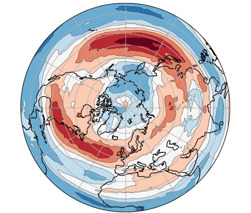

<p align="center">
  
</p>

<h1 align="center">Canari-ML</h1>

<p align="center">
  <a href="https://github.com/canari-ml/canari-ml/actions/workflows/test.yaml?query=branch%3Amain">
    
  </a>
  <a href="https://opensource.org/licenses/MIT">
    
  </a>
  <a href="https://canari-ml.readthedocs.io/">
    
  </a>
  <a href="https://github.com/astral-sh/ruff">
    
  </a>
  <a href="https://www.python.org/">
    
  </a>
</p>

Canari-ML is a machine learning library based on PyTorch lightning for wind forecasting across the North Atlantic.

It is designed to be used in conjunction with the [environmental-forecasting](http://github.com/environmental-forecasting/) initiative which is used for data download and for majority of the pre-processing steps to prepare the source data for training and prediction.

## Table of Contents

- [Features](#features)
- [Installation](#installation)
- [Usage](#usage)
- [Documentation](#documentation)
- [License](#license)
- [Contributing](#contributing)

## Features

- **Models**: Currently, a reference UNet model is implemented for wind forecasting.
- **Preprocessing**: Utilities for loading, reprojecting, and preprocessing ERA datasets using.
- **Prediction**: Tools for making predictions on new data using trained models.
- **Visualisation**: Tools for visualising the results of predictions and model training.

## Installation

`canari-ml` can be installed from the source as it is not on PyPI yet:

```bash
pip install git+https://github.com/CANARI-ML/canari-ml@main
```

## Usage

There are various command line entry points for the package which can be found using `canari_ml --help`.

## Documentation

The latest documentation can be found on [Read the Docs](https://canari-ml.readthedocs.io).

## License

CANARI-ML is licensed under the MIT license. See [LICENSE](https://github.com/CANARI-ML/canari-ml/blob/main/LICENSE) for more information.

## Contributing

Contributions are welcome!

Please follow the [Conventional Commits](https://www.conventionalcommits.org/en/v1.0.0/) standard for commit messages. Any that do not follow this standard will not be merged into the main branch and may be rejected.

Please see [CONTRIBUTING](https://github.com/CANARI-ML/canari-ml/blob/main/CONTRIBUTING.md) for more information on how to contribute.

CANARI-ML is a work in progress and will be updated as development progresses.

## Release

This repo uses the [Commitizen](https://commitizen-tools.github.io/commitizen/) package (installed as dev dependency) to manage changelogs and package version control.

To bump to the next stable version:

```bash
cz bump
```

Examples:

v0.0.1 → v0.0.2

To release an alpha version:

```bash
cz bump --prerelease alpha
```

Examples:

v1.0.4 → v1.0.5-alpha.0
v1.0.5-alpha.0 → v1.0.5-alpha.1

To start a new patch-level prerelease explicitly:

```bash
cz bump --increment patch --prerelease alpha
```

Examples:

v1.2.4-alpha.3 → v1.2.5-alpha.0

For full documentation on its usage, please peruse the [Commitizen docs](https://commitizen-tools.github.io/commitizen/commands/bump/).